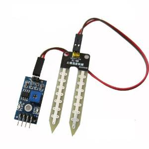
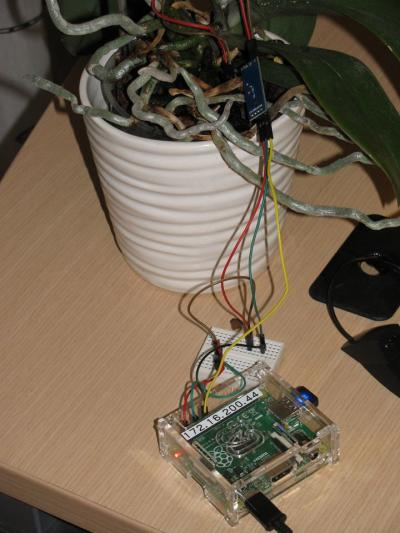
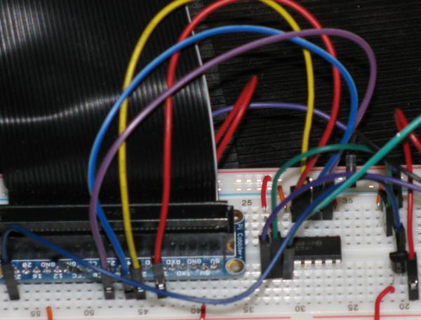
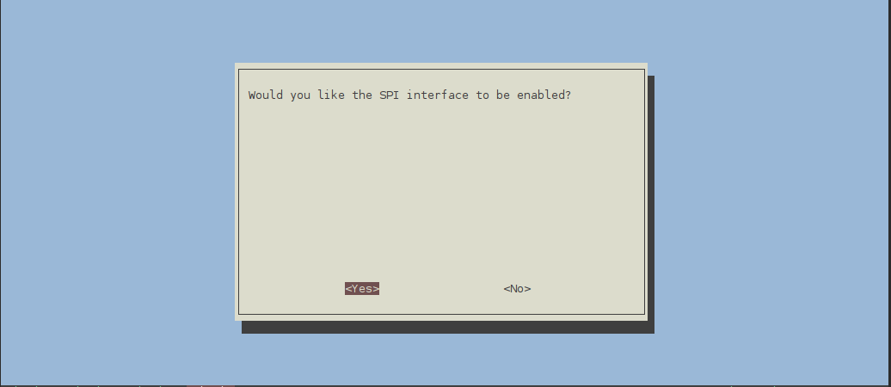
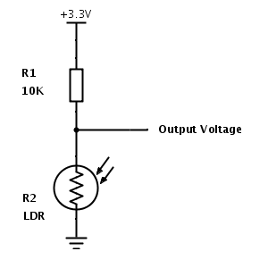
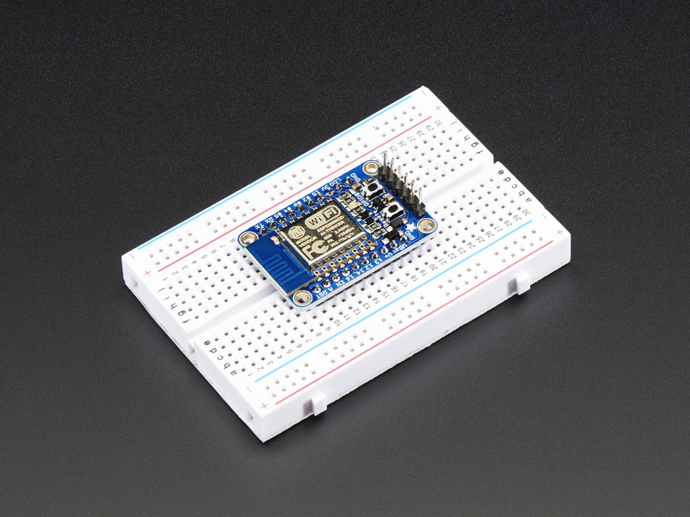

--
### Tweeting plants

So everything got started with this. I wanted to be kept abreast about when my orchid needs watering. So I bought one of these devices



--

### Sunkee Soil hygrometer or clones

Works in two modes:

* digital -- plant needs watering or not
* analog -- returns analog value.

So I ended up with this

Using hygrometer in digital mode and hooking it up to tweeter via tweepy.

--

### Orchid




--

### Shortcomings

* Orchid is a really bad plant to monitor soil moisture
* Digital readings don't really give you any interesting information
* I want to use other analog inputs like temperature, daily sunling


--

### Working with analogue inputs on Raspberry PI

Raspberry Pi, unlike arduino, beaglebone does not have analogue IO pins.

* Analog works with `MCP 3008` ADC chip with SPI interface
* There's plenty documentation.

--


### Configuring dependencies

    # aptitude install python3-dev python3-rpi.gpio


---

### The chip


--

### MCP 3008 Pinout (raspberry pi side)

**VDD** -- Power

**VREF** -- Analog voltage reference (used to change voltage scale)

**AGND** -- Analog Ground (used in precision circuitry), Connects to GND.

**CLK** -- Clock Pin

**DOUT** -- Data out from MCP3008

**DIN** -- Data in from Raspberry Pi

**CN** -- Chip select

--

### Wiring table


|MCP 3008| Raspberry Pi| Cable Color|
|--------|-------------|------------|
|VDD     | 3.3V        | Red        |
|VREF    | 3.3V        | Red        |
|AGND    | GND         | Black      |
|CLK     | #18         | Orange     |
|DOUT    | #23         | Yellow     |
|DIN     | #24         | Blue       |
|CS      | #25         | Violet     |
|DGND    | GND         | Black      |

---

### Actual wiring



--

### Soil Hygrometer HL-01/YL-69

The two pins from controller (HL-01) to the probe (YL-69) can be connected in any order.

Controller Pins

|HL-01|Breadbord|
|-----|---------|
|A0   | CH0     |
|D0   | Not used in analog mode |
|GND  | GND  |
|VCC  | 5V |

--

### Enable SPI

Run `raspi-config`

Advanced Options -> SPI

Would you like the SPI interface to be enabled? `Yes`

Would you like the SPI kernel module to be loaded by  default? `Yes`

Reboot the pi.

--

### Enable SPI



--

### Setting up pins

```python
def spi_readout():
    SPICLK = 18
    SPIMISO = 23
    SPIMOSI = 24
    SPICS = 25

    # set up the SPI interface pins
    GPIO.setup(SPIMOSI, GPIO.OUT)
    GPIO.setup(SPIMISO, GPIO.IN)
    GPIO.setup(SPICLK, GPIO.OUT)
    GPIO.setup(SPICS, GPIO.OUT)


    return readadc(potentiometer_adc, SPICLK, SPIMOSI, SPIMISO, SPICS)
```

--

### Analog readings

Potentiometer readings:

|Connection Type | Reading |
|----------------|---------|
|Air             | 1023    |
|Water           | 520-580 |
|Shorted Pins    | 40      |
|Soil watered 1 day ago| 520-560|

--

### Analog readings (Pt. 2)

Screw adjuster trigger point for digital reading does not affect the sensitivity of analog readings. However, once inserted the readings gradually decreased from initial 560 to 517 a few minutes later.


--

##### Controlling 5V rail with PN2222A Transistor


**Collector** -- Input Voltage

**Base** -- Control current

**Emitter** -- Output Voltage

--

### Controlling transistor

```python

def power_on():
    GPIO.setup(POWER_PIN, GPIO.OUT)
    GPIO.output(POWER_PIN, True)


def power_off():
    GPIO.output(POWER_PIN, False)

if __name__ == "__main__":
    power_on()
    time.sleep(1)
    print("Hygrometer value %d" % spi_readout())
    time.sleep(1)
    power_off()
    GPIO.cleanup()
```

--

### Temperature sensor

Connection scheme:

**Collector** -- 3.3 V

**Base** -- Analog readout (to MCP3008 Pin #2)

**Emitter** -- Ground

--

### Temperature converting millivolts to C

```python

def adc_to_temp(readout):
    millivolts = readout * (3300.0 / 1024.0)
    temp_c = ((millivolts - 100.0) / 10.0) - 40.0
    return temp_c
```

--

### A better way of controlling MCP3008 -- GPIOZERO

Using gpiozero library

    # apt-get install python-gpiozero

Reading MCP3008 output with GPIOZERO

--

### gipozero code

```python

from gpiozero import MCP3008

temp = MCP3008(channel=1, device=0)
temp_c = (temp.value * 3.3 - 0.5) * 100
print("Temperature ", temp_c, " C")
```

--

### Photo resitor

Wiring diagram



--

### Photoresistor code

```python

light_level = (float(spi_readout(LIGHT))/1024.0) * 100.0

```

--

### Honorable mention -- ESP8266

The ESP8266 WiFi Module is a self contained SOC with integrated TCP/IP protocol stack that can give any microcontroller access to your WiFi network

Adafruit HUZZAH ESP8266 Breakout -- $10 US


--



--

### MicroPython

MicroPython Firmware on kickstarter -- https://www.kickstarter.com/projects/214379695/micropython-on-the-esp8266-beautifully-easy-iot

 Python programming language with standard API for ubiquitous ESP8266 WiFi chip, optimised and well supported.