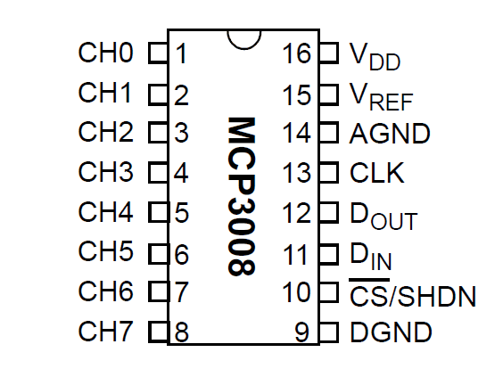

--
### Tweeting plants

So everything got started with this. I wanted to be kept abreast about when my orchid needs watering. So I bought one of these devices

--

### Sunkee Soil hygrometer or clones

Works in two modes:

* digital -- plant needs watering or not
* analog -- returns analog value.

So I ended up with this

Using hygrometer in digital mode and hooking it up to tweeter via tweepy.

--

### Orchid

--

### Shortcomings

* Orchid is a really bad plant to monitor soil moisture
* Digital readings don't really give you any interesting information
* I want to use other analog inputs like temperature, daily sunling

--

### Working with analogue inputs on Raspberry PI

Raspberry Pi, unlike arduino, beaglebone does not have analogue IO pins.

* Analog works with `MCP 3008` ADC chip with SPI interface
* There's plenty documentation.

--

### Configuring dependencies

    # aptitude install python3-dev python3-rpi.gpio

---

### The chip

--

### MCP 3008 Pinout (raspberry pi side)

**VDD** -- Power

**VREF** -- Analog voltage reference (used to change voltage scale)

**AGND** -- Analog Ground (used in precision circuitry), Connects to GND.

**CLK** -- Clock Pin

**DOUT** -- Data out from MCP3008

**DIN** -- Data in from Raspberry Pi

**CN** -- Chip select

--

### Wiring table

|MCP 3008| Raspberry Pi| Cable Color|
|--------|-------------|------------|
|VDD     | 3.3V        | Red        |
|VREF    | 3.3V        | Red        |
|AGND    | GND         | Black      |
|CLK     | #18         | Orange     |
|DOUT    | #23         | Yellow     |
|DIN     | #24         | Blue       |
|CS      | #25         | Violet     |
|DGND    | GND         | Black      |

---

### Actual wiring

--

### Soil Hygrometer HL-01/YL-69

The two pins from controller (HL-01) to the probe (YL-69) can be connected in any order.

Controller Pins

|HL-01|Breadbord|
|-----|---------|
|A0   | CH0     |
|D0   | Not used in analog mode |
|GND  | GND  |
|VCC  | 5V |

--

### Enable SPI

Run `raspi-config`

Advanced Options -> SPI

Would you like the SPI interface to be enabled? `Yes`

Would you like the SPI kernel module to be loaded by  default? `Yes`

Reboot the pi.

--

### Enable SPI

--

### Analog readings

Potentiometer readings:

|Connection Type | Reading |
|----------------|---------|
|Air             | 1023    |
|Water           | 520-580 |
|Shorted Pins    | 40      |
|Soil watered 1 day ago| 520-560|

--

### Analog readings (Pt. 2)

Screw adjuster trigger point for digital reading does not affect the sensitivity of analog readings. However, once inserted the readings gradually decreased from initial 560 to 517 a few minutes later.

--

##### Controlling 5V rail with PN2222A Transistor

**Collector** -- Input Voltage

**Base** -- Control current

**Emitter** -- Output Voltage

--